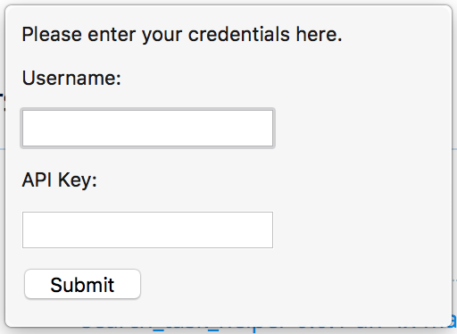

# Web Navigation Logger

A Firefox addon that reports when and how long you visit URLs when using Firefox.

Right after you install this add-on, you will see a request to authenticate.
The add-on only reports data from folks who have a valid login.
Ask the project maintainer to receive a login.

## How we handle data

This add-on uploads every new URL you visit, and the time you spend at each one.
It uploads this data over HTTPS.
In other words, it's securely transmitted in a way that your navigation behavior is safe from public eyes.

This data is very handy for us (the research team), as we're studying how developers search.
Right now, the add-on is only intended for in-lab use.
But what this means is that when you have this add-on installed, please don't visit any URLs or enter any form data that you wouldn't want to be visible to the research staff.
It won't be publicly visible, but it will be visible to someone on the research team.
To stop reporting data to the server, uninstall this add-on.

## Development Notes

Note that in the future this project could / should be implemented with the [WebExtensions API](https://developer.mozilla.org/en-US/Add-ons/WebExtensions), which will allow cross-browser compatibility.
For the sake of convenience and familiarity, I have currently implemented it with the [Firefox Add-on SDK](https://developer.mozilla.org/en-US/Add-ons/SDK).
